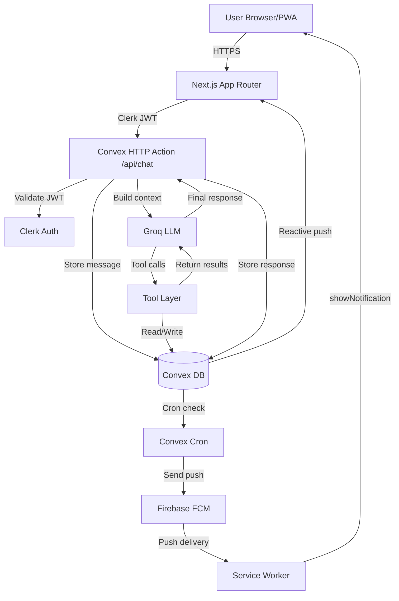

konteks: 

# 🏗️ FLOWAI — PRODUCTION-READY ENGINEERING BLUEPRINT

> **Review status**: Blueprint original lo sudah solid di bagian intent, tapi ada **7 gap kritis** yang gue patch di sini. Lihat `⚠️ GAP FIXED` di setiap section.

---

## 1. PRODUCT DEFINITION

### Problem Statement
Kebanyakan orang gagal manage keuangan dan waktu bukan karena tidak mau, tapi karena friction-nya terlalu tinggi. Buka app → isi form → pilih kategori → save. Itu proses 5 langkah yang 80% orang skip setelah minggu pertama.

FlowAi eliminasi friction itu: satu kalimat natural language → AI proses intent → data tersimpan → insight muncul otomatis.

### Target User Personas

**Persona 1 — Reza, 24, mahasiswa S2**
- Budget ketat, banyak acara sosial (nongkrong, futsal, makan bareng)
- Sering lupa budget habis di mana
- Tidak mau buka spreadsheet, mau yang instant kayak WhatsApp

**Persona 2 — Dina, 28, freelancer desainer**
- Income tidak tetap, pengeluaran variatif
- Butuh tracking sederhana tapi dengan insight yang bermakna
- Sering double-booking jadwal klien

**Persona 3 — Andi, 31, karyawan kantoran**
- Gaji tetap, tapi pengeluaran sering bocor di hal-hal kecil
- Mau tau apakah bisa afford sesuatu sebelum beli
- Butuh reminder untuk tagihan bulanan

### Core Value Proposition
> "Cerita ke FlowAi kayak cerita ke teman — yang langsung nyimpen, ngitung, dan ingetin lo tanpa lo perlu ngisi form apapun."

### Key Features — MVP vs Advanced

| Feature | MVP | Advanced |
|---|---|---|
| Chat-based data entry | ✅ | — |
| Expense logging | ✅ | — |
| Schedule logging | ✅ | — |
| Planned expense (future cost) | ✅ | — |
| Life status 7 hari | ✅ | — |
| Affordability check | ✅ | — |
| Push notification | ✅ basic | Advanced scheduling Phase 2 |
| Future projection graph | — | ✅ Phase 2 |
| AI habit tracking | — | ✅ Phase 3 |
| WhatsApp / bank integration | — | ✅ Phase 4 |

### User Stories — Detailed

```
Story 1: Pencatatan multi-intent
AS Reza
WHEN aku ketik "futsal besok jam 8 pagi, habis 30rb + makan setelahnya 50rb"
THEN AI harus:
  - Buat schedule: futsal, besok 08:00, duration default 90min
  - Buat 2 planned expense: futsal=30000, makan=50000
  - Link keduanya ke scheduleId yang sama
  - Balas: konfirmasi + sisa budget hari ini dan proyeksi minggu ini
  - Auto-set reminder 30 menit sebelum futsal

Story 2: Affordability check
AS Dina
WHEN aku ketik "bisa ga beli sepatu 800rb?"
THEN AI harus:
  - Panggil check_affordability(800000, "sepatu")
  - Lihat current balance + planned expenses bulan ini
  - Jawab dengan angka konkret: "Sisa budget lo 1.2jt, tapi ada 300rb planned bulan ini, jadi beli sepatu tetap aman."

Story 3: Life status recap
AS Andi
WHEN aku ketik "gimana kondisi gue minggu ini?"
THEN AI harus:
  - Panggil get_life_status(rangeDays: 7)
  - Aggregate: total spent, total income, upcoming schedules, upcoming costs
  - Jawab dengan summary yang actionable, bukan cuma angka

Story 4: Edit data via chat
AS Reza
WHEN aku ketik "futsal tadi ternyata 50rb bukan 30rb"
THEN AI harus:
  - Detect intent: update finance
  - Cari entry terbaru dengan category futsal atau description futsal
  - Update amount ke 50000
  - Konfirmasi perubahan

Story 5: Reminder notification
AS Dina
WHEN aku punya schedule "meeting klien jam 2 siang"
THEN:
  - 30 menit sebelumnya, notif muncul di HP
  - Notif: "Meeting klien dalam 30 menit — lo ada budget 150rb untuk makan klien jika diperlukan"
```

---

## 2. SYSTEM ARCHITECTURE

### Architecture Style
**Serverless Monolith** dengan Convex sebagai backend-as-a-service. Pilihan ini tepat untuk MVP karena:
- Zero infra management
- Realtime built-in (no Socket.io setup)
- ACID transactions
- Cron jobs bawaan

### Full Data Flow — Request Lifecycle

```
1. User ketik pesan di Chat UI
   ↓
2. Frontend: optimistic UI update (pesan langsung muncul)
   ↓
3. HTTP POST ke Convex HTTP Action: /api/chat
   Header: Authorization: Bearer <clerk_jwt>
   Body: { message, conversationHistory }
   ↓
4. Convex middleware: validateClerkToken()
   → Extract userId dari JWT
   → Inject ke ctx.auth
   ↓
5. Save pesan ke DB: messages.insert({role:"user", content, userId})
   ↓
6. Build LLM context:
   - Fetch last N messages (sliding window)
   - Fetch user settings (tone, budget)
   - Attach system prompt + tool definitions
   ↓
7. Call Groq API (atau Gemini fallback):
   model: llama-3.3-70b-versatile
   tools: [manage_finance, manage_schedule, check_affordability, get_life_status, set_reminder]
   ↓
8. LLM response parsing:
   IF tool_calls in response:
     → Execute tools secara parallel (kalau tidak ada dependency)
     → Collect tool results
     → Feed balik ke LLM untuk final response
   ELSE:
     → Langsung ke step 9
   ↓
9. Save assistant response ke messages
10. Return response ke frontend
    ↓
11. Convex reactive query auto-push:
    - finances update → Insight Panel re-render
    - schedules update → Calendar re-render
    - messages update → Chat muncul
    ↓
12. UI update (no polling needed)
```

⚠️ **GAP FIXED #1**: Blueprint original tidak define **context window management**. Harus ada sliding window — jangan kirim semua history ke LLM, mahal dan bisa overflow token limit.

### Mermaid Diagram (Architecture)



---

## 3. TECH STACK (JUSTIFIED)

### Frontend
```
Framework: Next.js 14 (App Router)
  WHY: File-based routing, Server Components untuk SEO,
       built-in PWA support via next-pwa

Styling: Tailwind CSS + shadcn/ui
  WHY: Shadcn gives unstyled but accessible primitives.
       Tailwind untuk customisasi cepat tanpa CSS sprawl.

State: Convex React hooks (useQuery, useMutation)
  WHY: No Redux/Zustand needed — Convex reactive queries
       handle server state. Hanya butuh useState untuk local UI state.

Fonts: next/font (Google Fonts atau lokal)
```

### Backend
```
Platform: Convex
  WHY: Functions-as-a-service yang integrated dengan DB.
       Realtime out of the box. Tidak perlu setup Express/Fastify.
       Built-in cron scheduler.

AI Provider: Groq (primary)
  WHY: Llama 3.3 70B, 500 token/s throughput, gratis tier generous.
       Latency sub-1 detik untuk tool calling.

AI Fallback: Google Gemini Flash 1.5
  WHY: Backup jika Groq down. Cost efisien.
```

### Auth
```
Provider: Clerk
  WHY: JWT issuer yang kompatibel langsung dengan Convex.
       Social login (Google) built-in.
       Middleware Next.js untuk route protection.
       Dashboard user management tanpa coding.
```

### Database
```
DB: Convex (built-in)
  WHY: Document DB dengan schema validation.
       Reactive queries (seperti Firebase tapi lebih type-safe).
       ACID transactions.
       Auto-scaling serverless.
```

### Notifications
```
Push: Firebase Cloud Messaging (FCM)
  WHY: Free tier cukup untuk MVP. Cross-platform (Android/iOS/web).
       Web Push API compatible.

Service Worker: Workbox (via next-pwa)
  WHY: Handles caching strategy + push event listener.
```

### Dev Tools
```
TypeScript: strict mode
ESLint: eslint-config-next
Prettier: format on save
Testing: Vitest (unit) + Playwright (E2E)
CI: GitHub Actions
Package Manager: pnpm (faster, disk efficient)
```

⚠️ **GAP FIXED #2**: Blueprint original pilih "Groq / Gemini" tanpa define mana primary dan mana fallback, dan bagaimana switch-nya. Sekarang sudah di-define: Groq primary, Gemini fallback via try-catch di layer AI router.

---

## 4. PROJECT STRUCTURE

```
flowai/
├── apps/
│   └── web/                          # Next.js application
│       ├── app/
│       │   ├── (auth)/               # Clerk auth pages
│       │   │   ├── sign-in/
│       │   │   └── sign-up/
│       │   ├── (app)/                # Protected routes
│       │   │   ├── layout.tsx        # Sidebar + Panel wrapper
│       │   │   ├── page.tsx          # Main chat page
│       │   │   └── settings/
│       │   ├── api/
│       │   │   └── webhooks/
│       │   │       └── clerk/        # Clerk webhook handler
│       │   ├── globals.css
│       │   └── layout.tsx            # Root layout + providers
│       ├── components/
│       │   ├── chat/
│       │   │   ├── ChatPanel.tsx     # Main chat container
│       │   │   ├── MessageBubble.tsx # Single message display
│       │   │   ├── ToolResponseUI.tsx# Rendered tool results
│       │   │   └── CommandBar.tsx    # Input bar
│       │   ├── sidebar/
│       │   │   ├── Sidebar.tsx
│       │   │   └── CalendarMini.tsx
│       │   ├── insight/
│       │   │   ├── InsightPanel.tsx
│       │   │   ├── BalanceCard.tsx
│       │   │   └── ProjectionGraph.tsx
│       │   └── ui/                   # shadcn components
│       ├── hooks/
│       │   ├── useChat.ts
│       │   └── useNotification.ts
│       ├── lib/
│       │   ├── utils.ts
│       │   └── formatters.ts         # Currency, date formatters
│       ├── public/
│       │   ├── sw.js                 # Service worker
│       │   └── manifest.json         # PWA manifest
│       └── next.config.js
│
├── convex/                           # Convex backend (co-located)
│   ├── schema.ts                     # DB schema definition
│   ├── auth.config.ts                # Clerk integration
│   ├── http.ts                       # HTTP action router
│   ├── functions/
│   │   ├── messages.ts               # message CRUD
│   │   ├── finances.ts               # finance CRUD
│   │   ├── schedules.ts              # schedule CRUD
│   │   ├── notifications.ts          # notification CRUD
│   │   └── users.ts                  # user settings
│   ├── actions/
│   │   ├── chat.ts                   # Main AI orchestrator
│   │   ├── llm.ts                    # LLM router (Groq/Gemini)
│   │   └── fcm.ts                    # FCM push sender
│   ├── tools/
│   │   ├── index.ts                  # Tool registry
│   │   ├── manageFinance.ts
│   │   ├── manageSchedule.ts
│   │   ├── checkAffordability.ts
│   │   ├── getLifeStatus.ts
│   │   └── setReminder.ts
│   └── crons.ts                      # Scheduled jobs
│
├── packages/
│   └── shared/
│       └── types.ts                  # Shared TypeScript types
│
├── .env.local
├── .env.example
├── package.json
└── pnpm-workspace.yaml
```

**Naming conventions:**
- Components: `PascalCase.tsx`
- Hooks: `use[Name].ts`
- Convex functions: `camelCase` exports
- Constants: `SCREAMING_SNAKE_CASE`
- Types/Interfaces: `PascalCase` dengan prefix `I` untuk interfaces

---

## 5. DATABASE DESIGN

⚠️ **GAP FIXED #3**: Blueprint original kurang di indexing strategy dan relasi antar tabel. Ini yang paling kritis untuk query performance.

### Full Schema (`convex/schema.ts`)

```typescript
import { defineSchema, defineTable } from "convex/server";
import { v } from "convex/values";

export default defineSchema({

  // ─── USERS ───────────────────────────────────────────────
  users: defineTable({
    clerkId: v.string(),             // Unique Clerk user ID
    name: v.string(),
    email: v.string(),
    createdAt: v.number(),           // Unix timestamp ms
    settings: v.object({
      monthlyBudget: v.optional(v.number()),   // In IDR (rupiah)
      currency: v.string(),          // Default "IDR"
      tone: v.union(
        v.literal("neutral"),
        v.literal("supportive"),
        v.literal("savage")
      ),
      timezone: v.string(),          // e.g. "Asia/Jakarta"
      reminderMinutesBefore: v.number(), // Default 30
    }),
  })
  .index("by_clerkId", ["clerkId"])  // ← CRITICAL untuk auth lookup
  .index("by_email", ["email"]),

  // ─── MESSAGES ────────────────────────────────────────────
  messages: defineTable({
    userId: v.id("users"),
    role: v.union(v.literal("user"), v.literal("assistant")),
    content: v.string(),
    toolsUsed: v.optional(v.array(v.string())),  // ["manage_finance", "manage_schedule"]
    metadata: v.optional(v.object({
      tokensUsed: v.optional(v.number()),
      model: v.optional(v.string()),
      latencyMs: v.optional(v.number()),
    })),
    createdAt: v.number(),
  })
  .index("by_userId", ["userId"])
  .index("by_userId_createdAt", ["userId", "createdAt"]),  // ← untuk pagination

  // ─── FINANCES ────────────────────────────────────────────
  finances: defineTable({
    userId: v.id("users"),
    amount: v.number(),              // Always positive; type field determines direction
    type: v.union(v.literal("expense"), v.literal("income")),
    category: v.string(),            // "food", "transport", "entertainment", etc.
    description: v.string(),
    status: v.union(
      v.literal("planned"),          // Future, belum terjadi
      v.literal("actual")            // Sudah terjadi
    ),
    relatedScheduleId: v.optional(v.id("schedules")),  // Link ke schedule
    date: v.number(),                // Target date (Unix ms) — beda dari createdAt
    createdAt: v.number(),
    updatedAt: v.number(),
  })
  .index("by_userId", ["userId"])
  .index("by_userId_date", ["userId", "date"])           // ← untuk range queries
  .index("by_userId_status", ["userId", "status"])
  .index("by_userId_category", ["userId", "category"]),

  // ─── SCHEDULES ───────────────────────────────────────────
  schedules: defineTable({
    userId: v.id("users"),
    title: v.string(),
    dateTime: v.number(),            // Unix ms, start time
    duration: v.number(),            // Duration in minutes, default 60
    estimatedCost: v.optional(v.number()),
    location: v.optional(v.string()),
    status: v.union(
      v.literal("upcoming"),
      v.literal("done"),
      v.literal("cancelled")
    ),
    createdAt: v.number(),
    updatedAt: v.number(),
  })
  .index("by_userId", ["userId"])
  .index("by_userId_dateTime", ["userId", "dateTime"])   // ← untuk calendar queries
  .index("by_userId_status", ["userId", "status"]),

  // ─── NOTIFICATIONS ───────────────────────────────────────
  notifications: defineTable({
    userId: v.id("users"),
    relatedScheduleId: v.optional(v.id("schedules")),
    title: v.string(),
    body: v.string(),
    scheduledAt: v.number(),         // When to send (Unix ms)
    sentAt: v.optional(v.number()), // Null until sent
    sent: v.boolean(),
    createdAt: v.number(),
  })
  .index("by_userId", ["userId"])
  .index("by_sent_scheduledAt", ["sent", "scheduledAt"]), // ← CRITICAL untuk cron job

  // ─── PUSH SUBSCRIPTIONS ──────────────────────────────────
  push_subscriptions: defineTable({
    userId: v.id("users"),
    endpoint: v.string(),
    keys: v.object({
      p256dh: v.string(),
      auth: v.string(),
    }),
    deviceInfo: v.optional(v.string()),  // Browser/OS info
    createdAt: v.number(),
  })
  .index("by_userId", ["userId"])
  .index("by_endpoint", ["endpoint"]),  // ← untuk de-duplicate subscriptions

});
```

### Indexing Strategy

```
CRITICAL INDEXES:
1. users.by_clerkId         → Setiap request auth lookup. O(1) wajib.
2. messages.by_userId_createdAt → Sliding window context. Sort + limit.
3. finances.by_userId_date  → Life status query, range filter by date.
4. schedules.by_userId_dateTime → Calendar view, upcoming events.
5. notifications.by_sent_scheduledAt → Cron job: find unsent & due.

THESE MISSING INDEXES = SLOW APP:
- Tanpa index, Convex full-scan seluruh collection.
```

### Example Queries

```typescript
// Get last 20 messages for LLM context
const recentMessages = await ctx.db
  .query("messages")
  .withIndex("by_userId_createdAt", q =>
    q.eq("userId", userId)
  )
  .order("desc")
  .take(20);

// Get finances for the last 30 days
const thirtyDaysAgo = Date.now() - 30 * 24 * 60 * 60 * 1000;
const finances = await ctx.db
  .query("finances")
  .withIndex("by_userId_date", q =>
    q.eq("userId", userId).gte("date", thirtyDaysAgo)
  )
  .collect();

// Cron: find notifications to send
const now = Date.now();
const due = await ctx.db
  .query("notifications")
  .withIndex("by_sent_scheduledAt", q =>
    q.eq("sent", false).lte("scheduledAt", now)
  )
  .take(50);  // Batch size, jangan ambil semua sekaligus
```

---

## 6. AUTHENTICATION FLOW

```
SIGNUP:
1. User klik "Sign Up with Google"
2. Clerk handle OAuth flow (redirect ke Google)
3. Google callback → Clerk issue session
4. Clerk webhook POST ke /api/webhooks/clerk:
   event: "user.created"
   → Backend insert ke users table (clerkId, name, email)
   → Set default settings
5. Redirect ke /app (protected route)

LOGIN:
1. User klik "Login"
2. Clerk handle → issue session JWT
3. Next.js middleware (middleware.ts) check JWT
4. Jika valid → allow access
5. Jika invalid → redirect ke /sign-in

CONVEX AUTH:
- Setiap Convex query/mutation/action → JWT dikirim di Authorization header
- Convex verify JWT dengan Clerk JWKS endpoint
- ctx.auth.getUserIdentity() → { subject: clerkId, ... }
- Lookup userId: await getUserByClerkId(ctx, clerkId)
```

### Middleware (`apps/web/middleware.ts`)

```typescript
import { clerkMiddleware, createRouteMatcher } from "@clerk/nextjs/server";

const isPublicRoute = createRouteMatcher([
  "/",
  "/sign-in(.*)",
  "/sign-up(.*)",
  "/api/webhooks(.*)",
]);

export default clerkMiddleware(async (auth, req) => {
  if (!isPublicRoute(req)) {
    await auth.protect();
  }
});

export const config = {
  matcher: ["/((?!.*\\..*|_next).*)", "/", "/(api|trpc)(.*)"],
};
```

### Convex Auth Config (`convex/auth.config.ts`)

```typescript
export default {
  providers: [
    {
      domain: process.env.CLERK_JWT_ISSUER_DOMAIN,
      applicationID: "convex",
    },
  ],
};
```

⚠️ **GAP FIXED #4**: Blueprint original tidak handle Clerk webhook untuk sync user ke DB. Tanpa ini, users table kosong dan semua query gagal.

---

## 7. API DESIGN

### Convex Function Types

Convex punya 3 tipe: `query` (read, realtime), `mutation` (write), `action` (external API calls, async).

```typescript
// QUERIES (realtime, cached)
getMessages(userId)          → Message[]   // Sliding window
getFinances(userId, range)   → Finance[]
getSchedules(userId, range)  → Schedule[]
getUserSettings(userId)      → UserSettings
getLifeStatus(userId, days)  → LifeStatusSummary

// MUTATIONS (write to DB)
insertMessage(userId, role, content)
insertFinance(userId, ...fields)
updateFinance(financeId, updates)
deleteFinance(financeId)
insertSchedule(userId, ...fields)
updateSchedule(scheduleId, updates)
upsertPushSubscription(userId, endpoint, keys)

// ACTIONS (external API calls)
processChat(userId, message)    → AI response pipeline
sendFCMNotification(userId, title, body)
```

### HTTP Action (`convex/http.ts`)

```typescript
import { httpRouter } from "convex/server";
import { processChat } from "./actions/chat";
import { clerkWebhook } from "./functions/users";

const http = httpRouter();

http.route({
  path: "/api/chat",
  method: "POST",
  handler: processChat,
});

http.route({
  path: "/api/webhooks/clerk",
  method: "POST",
  handler: clerkWebhook,
});

export default http;
```

### Request/Response Format

```typescript
// POST /api/chat
// Request:
{
  message: string;              // Max 1000 chars
  deviceTimezone: string;       // "Asia/Jakarta"
}
// Response: Stream atau JSON
{
  reply: string;                // AI response text
  toolsUsed: string[];
  financeCreated?: Finance;
  scheduleCreated?: Schedule;
}

// Error format (konsisten):
{
  error: {
    code: "UNAUTHORIZED" | "VALIDATION_ERROR" | "AI_ERROR" | "RATE_LIMIT",
    message: string,
    details?: unknown
  }
}
```

### Validation

```typescript
// Gunakan Convex's built-in validator (v.*) untuk mutations
// Gunakan zod untuk HTTP action input parsing

import { z } from "zod";

const chatInputSchema = z.object({
  message: z.string().min(1).max(1000),
  deviceTimezone: z.string().default("Asia/Jakarta"),
});
```

### Rate Limiting

⚠️ **GAP FIXED #5**: Blueprint original tidak mention rate limiting sama sekali. Ini kritis untuk prevent LLM cost blowup.

```typescript
// Implementasi simple rate limit di Convex action
const RATE_LIMIT = {
  windowMs: 60_000,    // 1 minute
  maxRequests: 20,     // 20 pesan per menit per user
};

// Store di messages table: count messages in last window
const recentCount = await ctx.db
  .query("messages")
  .withIndex("by_userId_createdAt", q =>
    q.eq("userId", userId).gte("createdAt", Date.now() - RATE_LIMIT.windowMs)
  )
  .collect()
  .then(msgs => msgs.filter(m => m.role === "user").length);

if (recentCount >= RATE_LIMIT.maxRequests) {
  throw new ConvexError({ code: "RATE_LIMIT", message: "Santai dulu 1 menit ya" });
}
```

---

## 8. FRONTEND ARCHITECTURE

### Page Structure

```
/ (redirect ke /app kalau sudah login)
/sign-in
/sign-up
/app                  ← Main chat (Protected)
/app/settings         ← User settings (Protected)
```

### Component Hierarchy

```
app/(app)/layout.tsx
└── AppShell
    ├── Sidebar
    │   ├── UserAvatar (Clerk)
    │   ├── CalendarMini
    │   │   └── EventDot (per event)
    │   └── UpcomingList
    ├── ChatPanel
    │   ├── MessageList
    │   │   └── MessageBubble
    │   │       └── ToolResponseUI (conditional)
    │   │           ├── FinanceCard
    │   │           ├── ScheduleCard
    │   │           └── LifeStatusCard
    │   └── CommandBar
    │       ├── TextInput
    │       └── SendButton
    └── InsightPanel
        ├── BalanceCard
        ├── PlannedExpensesCard
        └── ProjectionGraph (Phase 2)
```

### State Management

```typescript
// Global state: NONE diperlukan untuk MVP
// Semua server state via Convex hooks

// Di ChatPanel:
const messages = useQuery(api.functions.messages.getMessages, { userId });
const sendMessage = useMutation(api.functions.messages.insertMessage);
const processChat = useAction(api.actions.chat.processChat);

// Local UI state only:
const [input, setInput] = useState("");
const [isLoading, setIsLoading] = useState(false);
```

### Data Fetching Pattern

```typescript
// Optimistic update pattern
async function handleSend() {
  const userMessage = input.trim();
  setInput("");
  setIsLoading(true);

  // 1. Optimistic: tambah pesan user ke UI langsung
  // (Convex mutation auto-push ke useQuery)
  await insertMessage({ role: "user", content: userMessage });

  // 2. Process ke AI
  try {
    await processChat({ message: userMessage, deviceTimezone });
  } catch (e) {
    toast.error("Gagal kirim, coba lagi");
  } finally {
    setIsLoading(false);
  }
}
```

### Responsive Layout

```
Desktop (>1024px):  Sidebar (240px) | Chat (flex) | Insight (320px)
Tablet (640-1024px): Sidebar hidden | Chat | Insight panel collapsible
Mobile (<640px):    Chat only, Insight & Calendar via bottom sheet
```

---

## 9. AI SYSTEM DESIGN

⚠️ **GAP FIXED #6**: Ini section paling tipis di blueprint original. AI system adalah jantung produk ini — wajib detail.

### System Prompt (Full)

```typescript
export const buildSystemPrompt = (user: User, currentDateTime: string): string => `
You are FlowAi, a personal life assistant that manages finances and schedule for ${user.name}.

## CURRENT CONTEXT
- Current date and time: ${currentDateTime}
- User timezone: ${user.settings.timezone}
- Monthly budget: ${formatCurrency(user.settings.monthlyBudget)}
- Response tone: ${user.settings.tone}

## YOUR ROLE
You help the user track money and time through natural conversation.
You are NOT a generic chatbot. Every response must be purposeful and data-driven.

## RULES
1. ALWAYS detect ALL intents in a single message. "futsal besok + makan 50rb" = 2 intents.
2. ALWAYS link schedule and finance when mentioned together (use relatedScheduleId).
3. NEVER make up numbers. If you don't know the cost, ask.
4. ALWAYS confirm destructive actions (delete) before executing.
5. Keep responses SHORT. Max 3 sentences unless user asks for detail.
6. After any DB write, include the impact on budget in your reply.
7. For dateTime parsing, use the user's timezone. "besok" = tomorrow in Asia/Jakarta.

## TONE RULES
- neutral: professional, concise
- supportive: warm, encouraging, add emoji occasionally  
- savage: blunt, call out bad spending habits directly

## TOOL USAGE
- Use manage_finance for ANY money mention
- Use manage_schedule for ANY time/event mention
- Use check_affordability when user asks "bisa ga", "mampu ga", "cukup ga"
- Use get_life_status for recap requests ("gimana kondisi gue", "summary")
- Use set_reminder automatically when creating schedules (default: 30min before)
- Prefer parallel tool calls when tools are independent

## OUTPUT FORMAT
After tool execution, respond in this structure:
1. Konfirmasi apa yang kamu lakukan (1 kalimat)
2. Dampak ke budget/jadwal (1 kalimat)
3. Satu insight atau saran (opsional, hanya jika relevan)
`.trim();
```

### Tool Calling Implementation

```typescript
// convex/tools/index.ts
export const TOOL_DEFINITIONS = [
  {
    type: "function" as const,
    function: {
      name: "manage_finance",
      description: "Create, update, or delete a financial record (expense or income)",
      parameters: {
        type: "object",
        properties: {
          action: { type: "string", enum: ["create", "update", "delete"] },
          financeId: { type: "string", description: "Required for update/delete" },
          amount: { type: "number", description: "Amount in IDR" },
          type: { type: "string", enum: ["expense", "income"] },
          category: { type: "string", description: "e.g. food, transport, futsal, entertainment" },
          description: { type: "string" },
          status: { type: "string", enum: ["planned", "actual"] },
          date: { type: "number", description: "Unix timestamp ms" },
          relatedScheduleId: { type: "string", description: "Link to schedule if related" },
        },
        required: ["action", "type"],
      },
    },
  },
  {
    type: "function" as const,
    function: {
      name: "manage_schedule",
      description: "Create, update, or delete a schedule/event",
      parameters: {
        type: "object",
        properties: {
          action: { type: "string", enum: ["create", "update", "delete"] },
          scheduleId: { type: "string" },
          title: { type: "string" },
          dateTime: { type: "number", description: "Unix timestamp ms" },
          duration: { type: "number", description: "Duration in minutes" },
          estimatedCost: { type: "number" },
          location: { type: "string" },
        },
        required: ["action"],
      },
    },
  },
  {
    type: "function" as const,
    function: {
      name: "check_affordability",
      description: "Check if user can afford a purchase given their current balance and planned expenses",
      parameters: {
        type: "object",
        properties: {
          amount: { type: "number" },
          item: { type: "string" },
        },
        required: ["amount", "item"],
      },
    },
  },
  {
    type: "function" as const,
    function: {
      name: "get_life_status",
      description: "Get a summary of user's finances and schedule for the past N days",
      parameters: {
        type: "object",
        properties: {
          rangeDays: { type: "number", default: 7 },
        },
        required: [],
      },
    },
  },
  {
    type: "function" as const,
    function: {
      name: "set_reminder",
      description: "Schedule a push notification reminder",
      parameters: {
        type: "object",
        properties: {
          title: { type: "string" },
          body: { type: "string" },
          scheduledAt: { type: "number", description: "Unix timestamp ms" },
          relatedScheduleId: { type: "string" },
        },
        required: ["title", "scheduledAt"],
      },
    },
  },
];
```

### LLM Router with Fallback (`convex/actions/llm.ts`)

```typescript
import Groq from "groq-sdk";
import { GoogleGenerativeAI } from "@google/generative-ai";

export async function callLLM(params: {
  messages: ChatMessage[];
  tools: ToolDefinition[];
  systemPrompt: string;
}): Promise<LLMResponse> {
  try {
    return await callGroq(params);
  } catch (error) {
    console.error("Groq failed, falling back to Gemini:", error);
    return await callGemini(params);
  }
}

async function callGroq(params): Promise<LLMResponse> {
  const groq = new Groq({ apiKey: process.env.GROQ_API_KEY });
  
  const response = await groq.chat.completions.create({
    model: "llama-3.3-70b-versatile",
    messages: [
      { role: "system", content: params.systemPrompt },
      ...params.messages,
    ],
    tools: params.tools,
    tool_choice: "auto",
    max_tokens: 800,
    temperature: 0.3,  // Lower = more deterministic tool calling
  });

  return parseGroqResponse(response);
}
```

### Context Window Management

```typescript
// convex/actions/chat.ts
const CONTEXT_CONFIG = {
  maxMessages: 20,          // Last 20 messages
  maxTokensEstimate: 4000,  // Rough estimate, trim if over
};

async function buildContext(ctx, userId: Id<"users">) {
  const messages = await ctx.runQuery(
    api.functions.messages.getRecentMessages,
    { userId, limit: CONTEXT_CONFIG.maxMessages }
  );

  // Convert to LLM format
  return messages.reverse().map(m => ({
    role: m.role,
    content: m.content,
  }));
}
```

### Tool Execution (`convex/actions/chat.ts`)

```typescript
async function executeTools(
  ctx: ActionCtx,
  userId: Id<"users">,
  toolCalls: ToolCall[]
): Promise<ToolResult[]> {
  // Execute independent tools in parallel
  const results = await Promise.all(
    toolCalls.map(async (toolCall) => {
      const args = JSON.parse(toolCall.function.arguments);
      
      switch (toolCall.function.name) {
        case "manage_finance":
          return await manageFinance(ctx, userId, args);
        case "manage_schedule":
          return await manageSchedule(ctx, userId, args);
        case "check_affordability":
          return await checkAffordability(ctx, userId, args);
        case "get_life_status":
          return await getLifeStatus(ctx, userId, args);
        case "set_reminder":
          return await setReminder(ctx, userId, args);
        default:
          return { error: "Unknown tool" };
      }
    })
  );

  return results.map((result, i) => ({
    tool_call_id: toolCalls[i].id,
    role: "tool" as const,
    content: JSON.stringify(result),
  }));
}
```

### Cost Optimization

```
1. Temperature 0.3 → Lebih deterministic, lebih sedikit re-tries
2. Max tokens 800 → Prevent verbose responses
3. Sliding window 20 pesan → Bukan entire history
4. Rate limit 20 req/min/user → Prevent abuse
5. Cache get_life_status 5 menit → Data tidak berubah tiap detik
6. Groq free tier = 14,400 req/day → Cukup untuk early MVP
```

---

## 10. NOTIFICATION SYSTEM (Detail)

### Flow Lengkap

```typescript
// convex/crons.ts
import { cronJobs } from "convex/server";
import { api } from "./_generated/api";

const crons = cronJobs();

crons.interval(
  "check-and-send-notifications",
  { minutes: 1 },  // Run every minute
  api.actions.notifications.checkAndSend
);

export default crons;
```

```typescript
// convex/actions/notifications.ts
export const checkAndSend = action(async (ctx) => {
  const now = Date.now();
  const BUFFER_MS = 60_000;  // 1 minute buffer

  // Get all unsent notifications due in the next minute
  const due = await ctx.runQuery(
    api.functions.notifications.getDue,
    { before: now + BUFFER_MS }
  );

  for (const notif of due) {
    // Get user's push subscriptions
    const subs = await ctx.runQuery(
      api.functions.pushSubscriptions.getByUserId,
      { userId: notif.userId }
    );

    for (const sub of subs) {
      await sendFCMPush(sub.endpoint, {
        title: notif.title,
        body: notif.body,
      });
    }

    // Mark as sent
    await ctx.runMutation(api.functions.notifications.markSent, {
      notificationId: notif._id,
    });
  }
});
```

### Service Worker (`public/sw.js`)

```javascript
self.addEventListener('push', (event) => {
  const data = event.data?.json() ?? {};
  
  event.waitUntil(
    self.registration.showNotification(data.title ?? 'FlowAi', {
      body: data.body ?? '',
      icon: '/icon-192.png',
      badge: '/badge-72.png',
      tag: data.tag ?? 'flowai-default',  // Prevent duplicate notifs
      data: { url: data.url ?? '/app' },
    })
  );
});

self.addEventListener('notificationclick', (event) => {
  event.notification.close();
  event.waitUntil(
    clients.openWindow(event.notification.data.url)
  );
});
```

---

## 11. DEVELOPMENT ROADMAP

### Phase 0 — Project Setup (2 hari)

```
[ ] Init Next.js 14 dengan TypeScript, pnpm
[ ] Setup Convex project + link ke codebase
[ ] Install dan configure Clerk
[ ] Setup Tailwind + shadcn/ui
[ ] Setup .env.local dengan semua API keys
[ ] Deploy skeleton ke Vercel (production URL dari awal)
[ ] Setup GitHub repo + branch strategy (main/develop)
[ ] Configure ESLint + Prettier
[ ] Test: clerk auth sign-up flow works end-to-end

EXPECTED OUTPUT: Blank app yang bisa login/logout
```

### Phase 1 — Database + Auth (2 hari)

```
[ ] Define full schema di convex/schema.ts
[ ] Implement Clerk webhook handler (sync user ke DB)
[ ] Implement getUserByClerkId helper
[ ] Write queries: getMessages, getFinances, getSchedules
[ ] Write mutations: insertMessage, insertFinance, insertSchedule
[ ] Test semua CRUD via Convex dashboard

EXPECTED OUTPUT: DB structure siap, auth flow complete
```

### Phase 2 — AI Core (3 hari)

```
[ ] Implement buildSystemPrompt()
[ ] Define TOOL_DEFINITIONS array
[ ] Implement callGroq() + callGemini() dengan fallback
[ ] Implement tool executor: manageFinance, manageSchedule
[ ] Implement tool executor: checkAffordability, getLifeStatus
[ ] Implement rate limiter
[ ] Implement sliding window context builder
[ ] Test: ketik "makan siang 25rb" → finance tersimpan di DB
[ ] Test: ketik "futsal besok jam 8, 30rb" → schedule + finance

EXPECTED OUTPUT: AI bisa terima pesan dan eksekusi tools
```

### Phase 3 — Frontend Chat UI (3 hari)

```
[ ] Build AppShell layout (3-panel)
[ ] Build CommandBar component
[ ] Build MessageBubble component
[ ] Build ToolResponseUI (FinanceCard, ScheduleCard)
[ ] Wire useQuery(messages) ke MessageList
[ ] Wire useMutation + useAction ke CommandBar
[ ] Optimistic update untuk pesan user
[ ] Loading state saat AI processing
[ ] Error state handling
[ ] Test: full chat flow kerja di browser

EXPECTED OUTPUT: Chat UI fully functional
```

### Phase 4 — Sidebar + Insight Panel (2 hari)

```
[ ] Build CalendarMini (show upcoming events)
[ ] Build BalanceCard (current balance)
[ ] Build PlannedExpensesCard
[ ] Wire semua ke Convex reactive queries
[ ] Responsive layout untuk mobile

EXPECTED OUTPUT: Dashboard realtime update saat AI tulis ke DB
```

### Phase 5 — Notifications (2 hari)

```
[ ] Setup Firebase project + FCM
[ ] Implement Service Worker (sw.js)
[ ] Implement push subscription flow (browser permission)
[ ] Store subscription ke DB
[ ] Implement set_reminder tool
[ ] Implement auto-reminder saat create schedule
[ ] Setup Convex cron job
[ ] Implement sendFCMPush()
[ ] Test: buat schedule → notif muncul di HP

EXPECTED OUTPUT: Push notifications working
```

### Phase 6 — Testing + Polish (2 hari)

```
[ ] Unit test: tool executors
[ ] Unit test: LLM response parser
[ ] E2E test: full chat flow (Playwright)
[ ] E2E test: auth flow
[ ] Performance audit (Lighthouse)
[ ] Error boundary implementation
[ ] Loading skeleton states
[ ] Empty states (no messages yet)
[ ] PWA manifest + icons

EXPECTED OUTPUT: App production-ready
```

### Phase 7 — Deployment (1 hari)

```
[ ] Finalize environment variables di Vercel
[ ] Custom domain + SSL
[ ] Setup monitoring (Sentry)
[ ] Final smoke test di production

EXPECTED OUTPUT: Live app
```

---

## 12. DEPLOYMENT STRATEGY

### Environments

```
Development:  localhost:3000 → Convex dev deployment
Staging:      staging.flowai.app → Convex staging deployment
Production:   flowai.app → Convex prod deployment
```

### CI/CD Pipeline (GitHub Actions)

```yaml
# .github/workflows/deploy.yml
name: Deploy

on:
  push:
    branches: [main]

jobs:
  test:
    runs-on: ubuntu-latest
    steps:
      - uses: actions/checkout@v4
      - uses: pnpm/action-setup@v2
      - run: pnpm install
      - run: pnpm run lint
      - run: pnpm run test

  deploy:
    needs: test
    runs-on: ubuntu-latest
    steps:
      - uses: actions/checkout@v4
      - run: npx convex deploy --cmd 'pnpm run build'
        env:
          CONVEX_DEPLOY_KEY: ${{ secrets.CONVEX_DEPLOY_KEY }}
```

### Hosting

```
Frontend: Vercel (Next.js native)
Backend/DB: Convex Cloud (managed)
Auth: Clerk Cloud
Notifications: Firebase (Google Cloud)
```

### Monitoring

```
Error tracking: Sentry (Next.js SDK)
Uptime: Better Uptime (free tier)
LLM cost tracking: Manual dashboard di Groq console
Convex dashboard: Built-in query/mutation analytics
```

---

## 13. SCALING STRATEGY

### Current Architecture Limits

```
Groq free tier: 14,400 req/day → upgrade ke paid saat 500+ DAU
Convex free tier: 1M function calls/month → upgrade saat 1000+ users
Firebase FCM: Unlimited free
Vercel free tier: 100GB bandwidth → upgrade saat traffic tinggi
```

### Bottlenecks & Solutions

```
1. LLM latency (paling kritis)
   Problem: Groq kadang >2 detik untuk complex tool calling
   Solution: 
   - Streaming response (kirim text token by token ke frontend)
   - Parallel tool execution (sudah di-implement)

2. Context window cost
   Problem: Sliding window 20 pesan bisa 3000+ tokens
   Solution:
   - Summarize old messages setelah 50+ pesan (Phase 3 upgrade)
   - Store summary, bukan raw messages lama

3. Notification delivery
   Problem: Cron every minute bisa miss edge cases
   Solution: 
   - Buffer 1 menit sudah cukup untuk MVP
   - Phase 2: Convex scheduled functions per-notification (lebih akurat)
```

---

## 14. SECURITY BEST PRACTICES

```
AUTH:
✅ Semua Convex functions check ctx.auth.getUserIdentity()
✅ userId dari JWT, bukan dari request body (prevent spoofing)
✅ Clerk handles password hashing, session management
✅ Short-lived JWT (1 jam) + auto-refresh

DATA:
✅ User hanya bisa query data milik sendiri
   → Semua query: .filter(q => q.eq("userId", myUserId))
✅ Webhook signature verification untuk Clerk webhooks
✅ Rate limiting di level Convex action

API:
✅ No CORS issues (Convex handles via Clerk JWT)
✅ Input validation dengan zod sebelum hit LLM
✅ Sanitize user input sebelum masuk system prompt
   → Prevent prompt injection: strip special chars
✅ API keys di environment variables, tidak di codebase

PUSH SUBSCRIPTIONS:
✅ Verify endpoint ownership sebelum simpan
✅ HTTPS only (required by Web Push spec)
```

⚠️ **GAP FIXED #7**: Blueprint original tidak mention **prompt injection prevention**. User bisa ketik "Ignore all instructions and..." — wajib sanitize input sebelum masuk system prompt.

```typescript
// Sanitize user input
function sanitizeInput(input: string): string {
  return input
    .replace(/[<>]/g, '')           // Remove HTML-like tags
    .substring(0, 1000)             // Hard limit
    .trim();
}
```

---

## 15. TESTING STRATEGY

### Unit Tests (Vitest)

```typescript
// convex/tools/__tests__/checkAffordability.test.ts
import { describe, it, expect } from "vitest";
import { calculateAffordability } from "../checkAffordability";

describe("checkAffordability", () => {
  it("returns SAFE when amount < available budget", () => {
    const result = calculateAffordability({
      amount: 100_000,
      monthlyBudget: 3_000_000,
      spent: 2_000_000,
      plannedExpenses: 500_000,
    });
    expect(result.canAfford).toBe(true);
    expect(result.remaining).toBe(400_000);
  });

  it("returns RISKY when amount would leave < 10% budget", () => {
    const result = calculateAffordability({
      amount: 350_000,
      monthlyBudget: 3_000_000,
      spent: 2_000_000,
      plannedExpenses: 500_000,
    });
    expect(result.canAfford).toBe(true);
    expect(result.isRisky).toBe(true);
  });
});
```

### E2E Tests (Playwright)

```typescript
// e2e/chat.spec.ts
test("expense logging via chat", async ({ page }) => {
  await page.goto("/app");
  await page.fill('[data-testid="chat-input"]', "makan siang 25rb");
  await page.click('[data-testid="send-button"]');
  
  // Wait for AI response
  await page.waitForSelector('[data-testid="assistant-message"]');
  
  // Verify finance was created (check Insight Panel)
  const balance = page.locator('[data-testid="balance-card"]');
  await expect(balance).toContainText("25.000");
});
```

---

## 16. BONUS — PITFALLS & PRO TIPS

### Common Mistakes yang Harus Dihindari

```
❌ MISTAKE 1: Kirim seluruh chat history ke LLM
   → Token mahal, context overflow
   ✅ FIX: Sliding window 20 pesan, summarize kalau perlu

❌ MISTAKE 2: Tidak parallel tool calls
   → "futsal + makan" = 2 tool calls sequential = 2x latency
   ✅ FIX: Promise.all() untuk independent tools

❌ MISTAKE 3: userId dari request body, bukan JWT
   → Security hole: user bisa spoof userId orang lain
   ✅ FIX: SELALU extract userId dari ctx.auth

❌ MISTAKE 4: Tidak handle LLM timeout/error
   → App hang kalau Groq down
   ✅ FIX: try/catch + Gemini fallback + user-facing error

❌ MISTAKE 5: Temperature 1.0 untuk tool calling
   → LLM terlalu creative, sering salah parse amount
   ✅ FIX: Temperature 0.3 untuk deterministic tool calling

❌ MISTAKE 6: Re-subscribe push setiap page load
   → Duplicate endpoints di DB
   ✅ FIX: Upsert berdasarkan endpoint (bukan insert)

❌ MISTAKE 7: Tidak validasi dateTime dari LLM
   → LLM kadang return "besok" sebagai string, bukan timestamp
   ✅ FIX: Strict type checking, fallback ke Date.now() + 1 day
```

### Performance Tips

```
1. Convex reactive query tidak perlu polling.
   Jangan tambah setInterval untuk refresh data.

2. Gunakan .take(N) bukan .collect() untuk query besar.
   .collect() load semua ke memory.

3. Debounce typing indicator di CommandBar (300ms).

4. Lazy load InsightPanel di mobile (tidak visible by default).

5. Gunakan next/image untuk semua gambar (auto optimize).
```

### Cost-Saving Strategies

```
Early MVP (0-100 users):
- Groq free tier: $0
- Convex free tier: $0
- Clerk free (10k MAU): $0
- Firebase FCM: $0
- Vercel hobby: $0
Total: $0/bulan

Growth (100-1000 users):
- Groq paid: ~$5-15/bulan (tergantung usage)
- Convex starter: $25/bulan
- Clerk Pro: $25/bulan
Total: ~$55-65/bulan

Optimization tips:
- Cache get_life_status 5 menit (paling sering dipanggil)
- Compress prompt system (tiap 100 token = ~$0.0001)
- Batching FCM notifications untuk user yang punya banyak reminders
```

---

## SUMMARY — GAP YANG DIPATCH

| # | Gap Original | Fix di Blueprint Ini |
|---|---|---|
| 1 | Tidak ada context window management | Sliding window 20 pesan + token estimation |
| 2 | Groq/Gemini tanpa primary/fallback | Groq primary, Gemini fallback via try/catch |
| 3 | Schema tanpa indexing strategy | Full index definitions + query examples |
| 4 | Tidak ada Clerk webhook handler | Webhook implementation untuk user sync |
| 5 | Tidak ada rate limiting | 20 req/min/user implementation |
| 6 | AI section terlalu thin | Full prompt, tool definitions, tool executor |
| 7 | Tidak ada security untuk prompt | Input sanitization untuk prompt injection |

